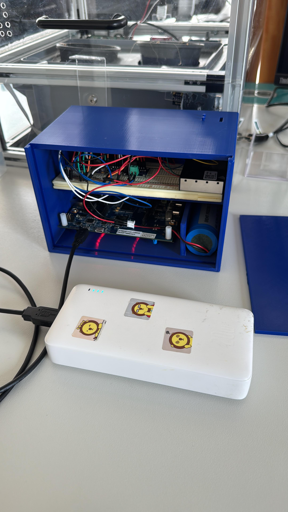

# 🌤️ STM32 Weather Station

An embedded environmental monitoring system based on the **STM32F769I-Discovery** board. It reads data from multiple sensors over I²C, monitors battery state of charge, and transmits all readings to a remote HTTP API via an ESP8266 Wi-Fi module. Data is visualized in real time on a **Grafana** dashboard.

---

## 📸 Gallery

### Hardware Wiring Diagram


### Physical Build (3D-Printed Enclosure)


### Grafana Live Dashboard


---

## ✨ Features

- Reads **temperature**, **humidity**, and **barometric pressure** from a BME280
- Reads **ambient light** (lux) from a BH1750
- Reads **PM2.5 and PM10 particulate matter** from a Sensirion SEN55 air quality sensor
- Monitors **battery voltage, current, power and State-of-Charge (SoC)** via an INA219
- Transmits all sensor data every **2 seconds** to a REST HTTP API over Wi-Fi using an ESP8266
- Visualizes data live in **Grafana**
- Green LED heartbeat indicates system activity

---

## 🧰 Hardware

| Component | Description | Interface |
|---|---|---|
| STM32F769I-Discovery | Main microcontroller board (216 MHz Cortex-M7) | — |
| BME280 | Temperature / Humidity / Pressure sensor | I²C @ `0x76` |
| BH1750 | Ambient light sensor | I²C @ `0x23` |
| SEN55 (SEN5x) | Air quality sensor (PM2.5, PM10, VOC) | I²C @ `0x69` |
| INA219 | Current / Voltage / Power monitor | I²C @ `0x40` |
| ESP8266-01 | Wi-Fi module for HTTP data transmission | UART5 @ 115200 |
| TPS61023 | Boost converter (+5V rail for SEN55) | — |
| LiPo 3.2V / 6000mAh | Main battery | — |
| Powerbank 5V / 6Ah | USB power supply backup | — |

---

## 📂 Project Structure

```
├── Core/
│   ├── main.c                  # Application entry point & main loop
│   ├── main.h                  # GPIO pin definitions, common includes
│   ├── stm32f7xx_hal_msp.c     # HAL MSP initialisation
│   ├── stm32f7xx_it.c / .h     # Interrupt handlers
│   ├── syscalls.c              # Newlib syscall stubs
│   ├── sysmem.c                # Heap management
│   └── system_stm32f7xx.c      # System clock initialisation
│
├── Drivers/
│   ├── bme280.c / .h           # BME280 temperature/humidity/pressure driver
│   ├── bme280_defs.h           # BME280 register & type definitions
│   ├── bh1750.c / .h           # BH1750 light sensor driver
│   ├── sen5x_i2c.c / .h        # Sensirion SEN5x low-level I²C driver
│   ├── sen5x_wrapper.c / .h    # High-level SEN5x wrapper (setup & read)
│   ├── sensirion_common.c / .h # Sensirion common utilities
│   ├── sensirion_config.h      # Sensirion platform configuration
│   ├── sensirion_i2c.c / .h    # Sensirion I²C abstraction layer
│   ├── sensirion_i2c_hal.c / .h# Sensirion HAL binding for STM32
│   ├── power_monitor.c / .h    # INA219 power monitor + SoC estimation
│   └── esp8266.c / .h          # ESP8266 Wi-Fi & HTTP transmission driver
│
└── images/
    ├── weather_station_img1.png  # Wiring diagram
    ├── weather_station_img2.jpeg # Grafana dashboard screenshot
    └── weather_station_img3.jpeg # Physical hardware build
```

---

## ⚙️ Peripherals & Configuration

| Peripheral | Settings |
|---|---|
| I²C1 | 7-bit addressing, timing `0x20404768` |
| UART5 | 115200 baud, 8N1, no flow control |
| ADC1 | 12-bit resolution, single conversion, SW trigger |
| System Clock | 216 MHz via HSE + PLL (25 MHz crystal) |

---

## 📡 Data Transmission

Sensor readings are packaged and sent every **2 seconds** to a configurable HTTP API endpoint.

### Configuration (in `esp8266.h`)

```c
#define WIFI_SSID          "your_wifi_ssid"
#define WIFI_PASSWORD      "your_wifi_password"
#define SERVER_HOST        "192.168.x.x"   // Your server IP
#define SERVER_PORT        "8000"
#define USER_ID            "1"
```

### Sensor Value IDs (API payload)

| Value ID | Sensor Field |
|---|---|
| `1` | Temperature (°C) |
| `2` | Humidity (%) |
| `4` | Illuminance (lux) |
| `5` | Pressure (hPa) |
| `6` | PM2.5 (µg/m³) |
| `7` | PM10 (µg/m³) |
| `100` | Battery SoC (%) |

---

## 🔋 Battery Monitoring

The **INA219** measures voltage and current from the 3.2V LiPo (6000mAh). State-of-Charge is estimated using a **combined approach**:

- **Voltage-based lookup** from a discharge curve table
- **Coulomb counting** (integration of current over time)
- Both methods are blended to produce a robust SoC estimate

---

## 🚀 Getting Started

### Prerequisites

- [STM32CubeIDE](https://www.st.com/en/development-tools/stm32cubeide.html) (or compatible ARM GCC toolchain)
- STM32F769I-Discovery board
- All hardware components listed in the [Hardware](#-hardware) section
- A running HTTP API server (e.g. FastAPI, Flask) to receive POST requests
- (Optional) Grafana + InfluxDB or similar stack for visualization

### Build & Flash

1. Clone this repository:
   ```bash
   git clone https://github.com/your-username/stm32-weather-station.git
   cd stm32-weather-station
   ```

2. Open the project in **STM32CubeIDE**.

3. Update Wi-Fi credentials and server details in `esp8266.h`.

4. Build the project (`Project → Build All`) and flash it to the board via ST-Link.

5. Power the board — the green LED will blink once on successful sensor initialisation, then toggle every 2 seconds as data is sent.

---

## 📊 Dashboard

The project was tested with a **Grafana** dashboard reading live sensor data. The screenshot above shows:
- Battery State of Charge gauge
- Real-time air temperature plot (26.4 °C)
- Humidity and other environmental trends

---

## 📋 Sensor Data Flow

```
[BME280]  ──┐
[BH1750]  ──┤
[SEN55]   ──┼──► STM32F769I ──► SensorData_t struct ──► ESP8266 ──► HTTP API ──► Grafana
[INA219]  ──┘
```

---

## 📄 License

This project is based on the STM32CubeHAL framework.
© 2025 STMicroelectronics — driver templates provided AS-IS under their respective license.
Custom application code is provided for educational purposes.
